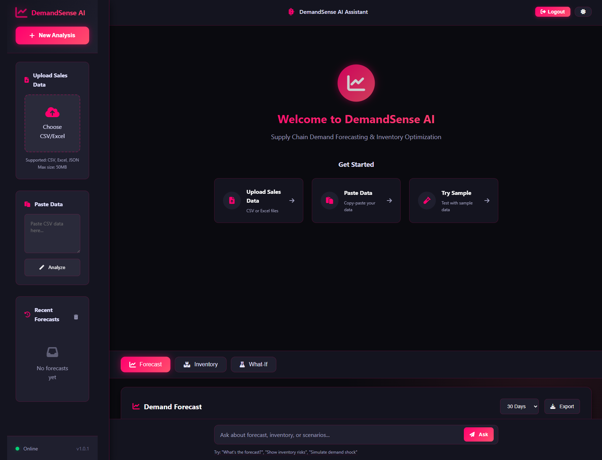
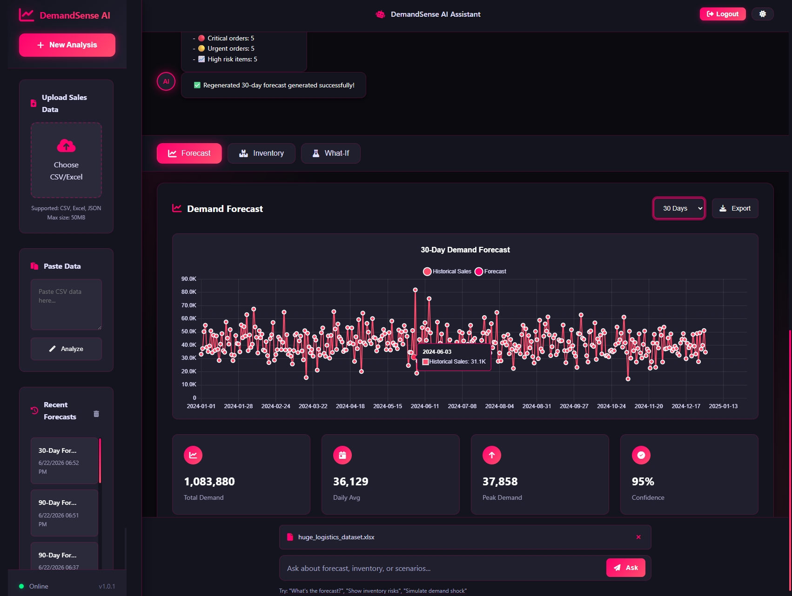

# 🎯 DemandSense AI
DemandSense AI is an AI-powered demand forecasting and inventory optimisation platform designed to help businesses predict future product demand, optimise stock levels, analyse scenarios, and generate intelligent business insights.
The project follows a modular architecture that separates frontend assets, backend logic, API routes, test suites, and supporting resources to improve maintainability, scalability, and ease of deployment.

 Here is the link to the DemandSense AI Application-heroku where you can login to access the AI-powered demand forecasting and inventory optimisation platform [link](https://demandsense-ai-f26d0ae2b62b.herokuapp.com/login)


   

   ## ✨ Overview

   **DemandSense AI** is an advanced web application that leverages artificial intelligence and statistical modeling to provide accurate demand forecasting and inventory optimization for supply chain management. With its stunning neon pink/red theme, responsive design, and PWA capabilities, it offers a modern, intuitive interface for supply chain professionals to make data-driven decisions.

   ```
   # DemandSense AI – Project Structure


demandsense-ai/
│
├── assets/
│   ├── src/
│   │   ├── app.js
│   │   ├── api.js
│   │   ├── cache-buster.js
│   │   ├── forecast-chart.js
│   │   ├── inventory-dashboard.js
│   │   ├── logout-modal.js
│   │   ├── what-if-panel.js
│   │   ├── data-validator.js
│   │   └── pdf-export.js
│   │
│   ├── index.html
│   ├── login.html
│   ├── styles.css
│   ├── manifest.json
│   ├── service-worker.js
│   ├── favicon.ico
│   │
│   ├── favicon/
│   │   ├── favicon-16x16.png
│   │   ├── favicon-32x32.png
│   │   └── apple-touch-icon.png
│   │
│   └── icons/
│       ├── icon-72.png
│       ├── icon-96.png
│       ├── icon-128.png
│       └── icon-512.png
│
├── server/
│   ├── server.js
│   ├── forecast-logic.js
│   ├── inventory-calculator.js
│   ├── prompt-templates.js
│   ├── seasonality-utils.js
│   └── external-factors.js
│
├── routes/
│   └── api/
│       ├── forecast.js
│       ├── inventory.js
│       ├── products.js
│       ├── scenarios.js
│       ├── reports.js
│       └── auth.js
│
├── data/
│   ├── sample-data/
│   │   ├── products-sample.json
│   │   └── inventory-sample.json
│   │
│   └── mock/
│       └── external-factors.json
│
├── tests/
│   ├── forecast.test.js
│   └── inventory.test.js
│
├── uploads/
│   └── .gitkeep
│
├── .env
├── .gitignore
├── package.json
├── package-lock.json
├── README.md
└── Procfile

Directory Overview

### `assets/`

Contains all client-side resources used by the web application.

#### `assets/src/`

Houses the application's JavaScript modules:

* **app.js** – Main application entry point responsible for initialising the user interface and coordinating frontend functionality.
* **api.js** – Handles communication between the frontend and backend APIs.
* **cache-buster.js** – Ensures users receive the latest application files by preventing stale cached assets.
* **forecast-chart.js** – Generates interactive demand forecasting visualisations.
* **inventory-dashboard.js** – Displays inventory metrics, KPIs, and stock insights.
* **logout-modal.js** – Controls logout confirmation dialogs and session termination prompts.
* **what-if-panel.js** – Enables scenario planning by allowing users to simulate changes in demand assumptions.
* **data-validator.js** – Validates uploaded datasets and user inputs before processing.
* **pdf-export.js** – Generates downloadable PDF reports and summaries.

Other frontend assets include:

* **index.html** – Main dashboard interface.
* **login.html** – User authentication page.
* **styles.css** – Global styling definitions.
* **manifest.json** – Progressive Web App configuration.
* **service-worker.js** – Enables offline capabilities and caching.
* **favicon.ico**, **favicon/**, and **icons/** – Branding assets and device icons.

---

### `server/`

Contains the application's backend business logic.

* **server.js** – Main Express server configuration and application entry point.
* **forecast-logic.js** – Implements demand forecasting algorithms and prediction workflows.
* **inventory-calculator.js** – Computes inventory recommendations such as reorder points and safety stock.
* **prompt-templates.js** – Stores reusable AI prompts for generating business insights.
* **seasonality-utils.js** – Provides utilities for identifying and applying seasonal patterns.
* **external-factors.js** – Incorporates external variables such as market trends, holidays, or economic influences into forecasting models.

---

### `routes/api/`

Defines RESTful API endpoints exposed by the application.

* **forecast.js** – Forecast generation endpoints.
* **inventory.js** – Inventory optimisation endpoints.
* **products.js** – Product data retrieval and management.
* **scenarios.js** – What-if scenario analysis endpoints.
* **reports.js** – Report generation and export functionality.
* **auth.js** – Authentication and authorisation processes.

---

### `data/`

Stores datasets used for development and testing.

#### `sample-data/`

Contains example datasets used to demonstrate functionality:

* `products-sample.json`
* `inventory-sample.json`

#### `mock/`

Contains mock datasets representing external influences:

* `external-factors.json`

---

### `tests/`

Contains automated tests to ensure reliability and correctness.

* **forecast.test.js** – Tests forecasting functionality.
* **inventory.test.js** – Tests inventory calculations and optimisation logic.

---

### `uploads/`

Temporary storage location for uploaded files and datasets.

* `.gitkeep` ensures the directory remains tracked by Git even when empty.

---

## Configuration Files

* **.env** – Stores environment variables and sensitive configuration settings.
* **.gitignore** – Specifies files and directories excluded from version control.
* **package.json** – Defines project metadata, scripts, and dependencies.
* **package-lock.json** – Locks dependency versions for consistent installations.
* **README.md** – Project documentation and setup instructions.
* **Procfile** – Deployment configuration for process-based hosting environments.

---

## Architectural Approach

DemandSense AI adopts a modular full-stack architecture that separates presentation, business logic, API routing, data resources, and testing. This separation of concerns improves maintainability, facilitates collaboration among development teams, simplifies debugging, and supports future expansion of forecasting and inventory optimisation capabilities.


   ```



   ## Key Capabilities

 - **📊 Demand Forecasting:** Generate accurate demand predictions using exponential smoothing and AI-enhanced insights

 - **📦 Inventory Optimization:** Calculate optimal stock levels, reorder points, and safety stock

 - **🔮 What-If Scenarios:** Simulate demand shocks, supply disruptions, and promotional impacts

 - **🤖 AI-Powered Insights:** Get actionable recommendations from AI while maintaining mathematical accuracy

 - **📱 PWA Ready:** Install as a native app on any device

 - **🎨 Neon Theme:** Modern, visually striking interface with pink/red aesthetics

 


