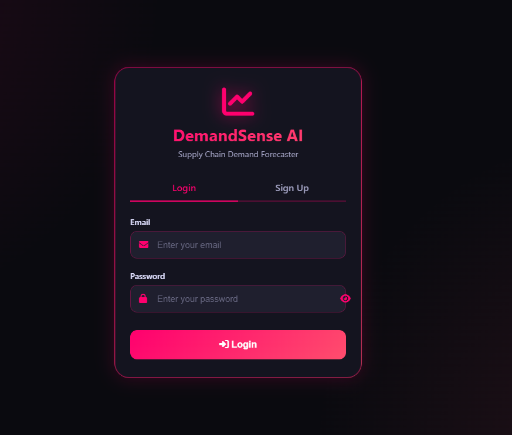
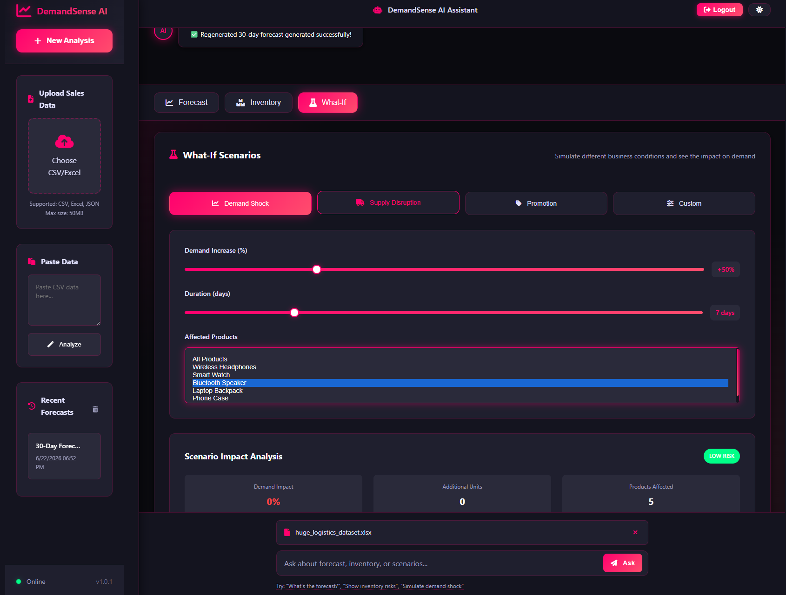
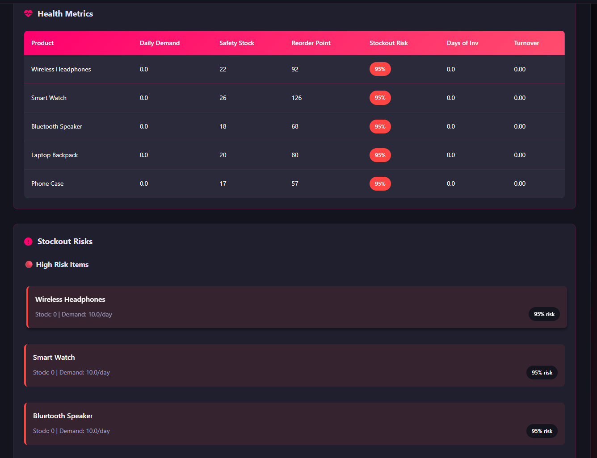
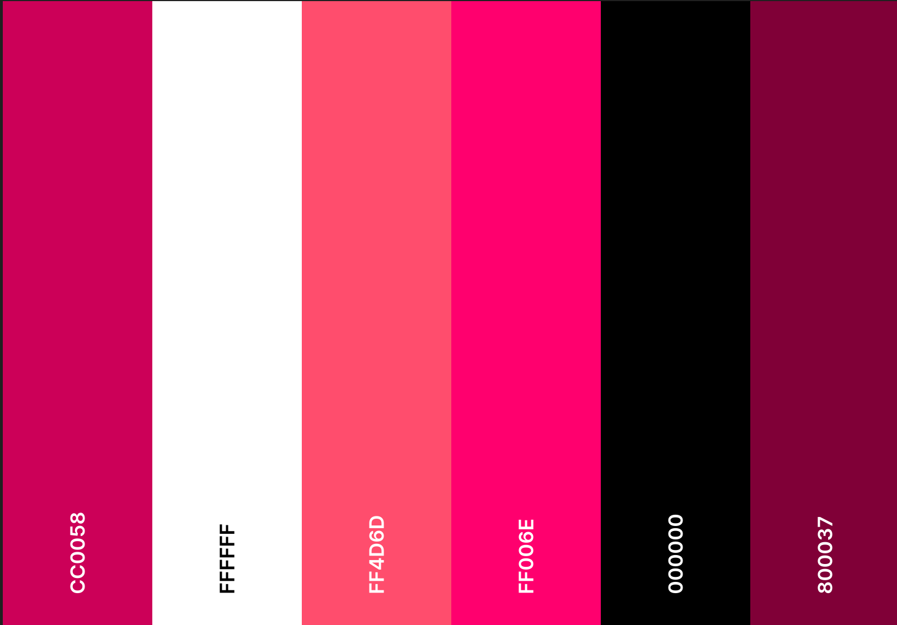
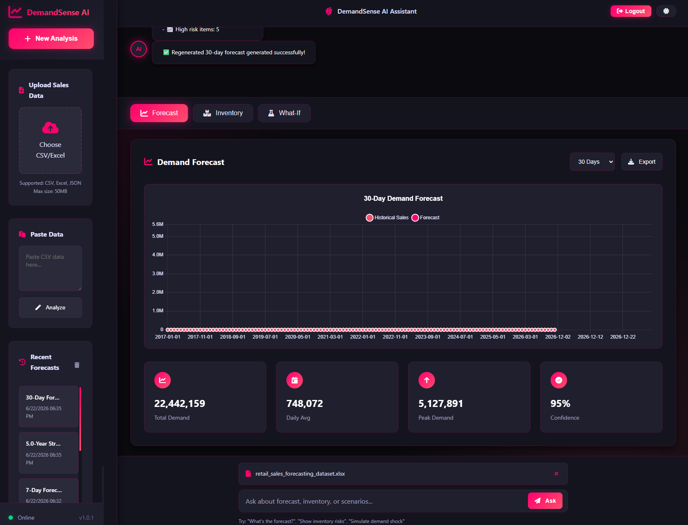
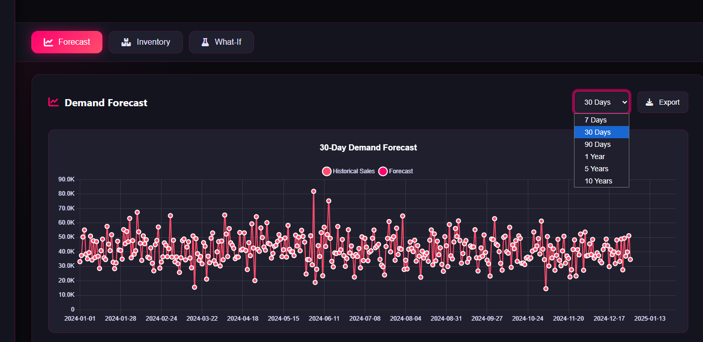

# 🎯 DemandSense AI
DemandSense AI is an AI-powered demand forecasting and inventory optimisation platform designed to help businesses predict future product demand, optimise stock levels, analyse scenarios, and generate intelligent business insights.
The project follows a modular architecture that separates frontend assets, backend logic, API routes, test suites, and supporting resources to improve maintainability, scalability, and ease of deployment.

 Here is the link to the DemandSense AI Application-heroku where you can login to access the AI-powered demand forecasting and inventory optimisation platform [link](https://demandsense-ai-f26d0ae2b62b.herokuapp.com/login)


   

   ## ✨ Overview

   **DemandSense AI** is an advanced web application that leverages artificial intelligence and statistical modeling to provide accurate demand forecasting and inventory optimization for supply chain management. With its stunning neon pink/red theme, responsive design, and PWA capabilities, it offers a modern, intuitive interface for supply chain professionals to make data-driven decisions.

   ## 📁 Project Structure

   ```
   # DemandSense AI – Project Structure


demandsense-ai/
│
├── assets/
│   ├── src/
│   │   ├── app.js
│   │   ├── api.js
│   │   ├── cache-buster.js
│   │   ├── forecast-chart.js
│   │   ├── inventory-dashboard.js
│   │   ├── logout-modal.js
│   │   ├── what-if-panel.js
│   │   ├── data-validator.js
│   │   └── pdf-export.js
│   │
│   ├── index.html
│   ├── login.html
│   ├── styles.css
│   ├── manifest.json
│   ├── service-worker.js
│   ├── favicon.ico
│   │
│   ├── favicon/
│   │   ├── favicon-16x16.png
│   │   ├── favicon-32x32.png
│   │   └── apple-touch-icon.png
│   │
│   └── icons/
│       ├── icon-72.png
│       ├── icon-96.png
│       ├── icon-128.png
│       └── icon-512.png
│
├── server/
│   ├── server.js
│   ├── forecast-logic.js
│   ├── inventory-calculator.js
│   ├── prompt-templates.js
│   ├── seasonality-utils.js
│   └── external-factors.js
│
├── routes/
│   └── api/
│       ├── forecast.js
│       ├── inventory.js
│       ├── products.js
│       ├── scenarios.js
│       ├── reports.js
│       └── auth.js
│
├── data/
│   ├── sample-data/
│   │   ├── products-sample.json
│   │   └── inventory-sample.json
│   │
│   └── mock/
│       └── external-factors.json
│
├── tests/
│   ├── forecast.test.js
│   └── inventory.test.js
│
├── uploads/
│   └── .gitkeep
│
├── .env
├── .gitignore
├── package.json
├── package-lock.json
├── README.md
└── Procfile

```

  


## 🤖 Core Features

 *feature*  and *Description* 
 ---
 **Login Page**  Sign up and add your Email Address

 **Data Upload**  Contains the name of the Files 
 
 **Data Pasting**  Copy-paste data directly into the application 
 
 **Forecast Generation**  Generate short-term (7-90 days) and long-term (1-10 years) forecasts 
 
 **Seasonality Detection**  Automatically detect weekly and monthly patterns 

 **Confidence Intervalsd**  Upper and lower bounds with customizable confidence levels 
 
 **AI Insights**  Actionable business insights from AI (Groq/DeepSeek) 
 
 **Inventory Dashboard**  ABC classification, reorder recommendations, stockout risks 
 
 **What-If Scenarios**  Demand shock, supply disruption, promotion simulation 
 
 **PDF Export**  Export forecasts and reports as PDF 
 
 **History Tracking**  View and manage previous forecast sessions 
 
 **Dark/Light Theme**  Toggle between dark and light modes 


 ---

  


## Directory Overview

```

### `assets/`

Contains all client-side resources used by the web application.

#### `assets/src/`

Houses the application's JavaScript modules:

* **app.js** – Main application entry point responsible for initialising the user interface and coordinating frontend functionality.
* **api.js** – Handles communication between the frontend and backend APIs.
* **cache-buster.js** – Ensures users receive the latest application files by preventing stale cached assets.
* **forecast-chart.js** – Generates interactive demand forecasting visualisations.
* **inventory-dashboard.js** – Displays inventory metrics, KPIs, and stock insights.
* **logout-modal.js** – Controls logout confirmation dialogs and session termination prompts.
* **what-if-panel.js** – Enables scenario planning by allowing users to simulate changes in demand assumptions.
* **data-validator.js** – Validates uploaded datasets and user inputs before processing.
* **pdf-export.js** – Generates downloadable PDF reports and summaries.

Other frontend assets include:

* **index.html** – Main dashboard interface.
* **login.html** – User authentication page.
* **styles.css** – Global styling definitions.
* **manifest.json** – Progressive Web App configuration.
* **service-worker.js** – Enables offline capabilities and caching.
* **favicon.ico**, **favicon/**, and **icons/** – Branding assets and device icons.

---

### `server/`

Contains the application's backend business logic.

* **server.js** – Main Express server configuration and application entry point.
* **forecast-logic.js** – Implements demand forecasting algorithms and prediction workflows.
* **inventory-calculator.js** – Computes inventory recommendations such as reorder points and safety stock.
* **prompt-templates.js** – Stores reusable AI prompts for generating business insights.
* **seasonality-utils.js** – Provides utilities for identifying and applying seasonal patterns.
* **external-factors.js** – Incorporates external variables such as market trends, holidays, or economic influences into forecasting models.

---

### `routes/api/`

Defines RESTful API endpoints exposed by the application.

* **forecast.js** – Forecast generation endpoints.
* **inventory.js** – Inventory optimisation endpoints.
* **products.js** – Product data retrieval and management.
* **scenarios.js** – What-if scenario analysis endpoints.
* **reports.js** – Report generation and export functionality.
* **auth.js** – Authentication and authorisation processes.

---

### `data/`

Stores datasets used for development and testing.

#### `sample-data/`

Contains example datasets used to demonstrate functionality:

* `products-sample.json`
* `inventory-sample.json`

#### `mock/`

Contains mock datasets representing external influences:

* `external-factors.json`

---

### `tests/`

Contains automated tests to ensure reliability and correctness.

* **forecast.test.js** – Tests forecasting functionality.
* **inventory.test.js** – Tests inventory calculations and optimisation logic.

---

### `uploads/`

Temporary storage location for uploaded files and datasets.

* `.gitkeep` ensures the directory remains tracked by Git even when empty.

---

## Configuration Files

* **.env** – Stores environment variables and sensitive configuration settings.
* **.gitignore** – Specifies files and directories excluded from version control.
* **package.json** – Defines project metadata, scripts, and dependencies.
* **package-lock.json** – Locks dependency versions for consistent installations.
* **README.md** – Project documentation and setup instructions.
* **Procfile** – Deployment configuration for process-based hosting environments.

---

## Architectural Approach

DemandSense AI adopts a modular full-stack architecture that separates presentation, business logic, API routing, data resources, and testing. This separation of concerns improves maintainability, facilitates collaboration among development teams, simplifies debugging, and supports future expansion of forecasting and inventory optimisation capabilities.


   ```


   ## Key Capabilities

 - **📊 Demand Forecasting:** Generate accurate demand predictions using exponential smoothing and AI-enhanced insights

 - **📦 Inventory Optimization:** Calculate optimal stock levels, reorder points, and safety stock

 - **🔮 What-If Scenarios:** Simulate demand shocks, supply disruptions, and promotional impacts

 - **🤖 AI-Powered Insights:** Get actionable recommendations from AI while maintaining mathematical accuracy

 - **📱 PWA Ready:** Install as a native app on any device

 - **🎨 Neon Theme:** Modern, visually striking interface with pink/red aesthetics

 


 ### 📂 **User Interface Features**

- **Responsive Sidebar:** Navigation with collapsible menu for mobile devices

- **Chat Interface:** Conversational AI assistant for demand queries

- **Interactive Charts:** Visual forecasts using Chart.js with zoom and pan

- **Real-time Updates:** Toast notifications for system status

- **Loading States:** Animated loaders for forecast generation

- **Mobile-Optimized:** Full support for all screen 


## 🛠️ Tech Stack

### Frontend

| **Technology** | **Version** | **Purpose**                         |
|:---------------|:-----------:|:------------------------------------|
| HTML5          |      -      | Semantic markup                     |
| CSS3           |      -      | Custom styles with CSS variables    |
| JavaScript     |    ES6+     | Application logic                   |
| Chart.js       |    4.5.1    | Data visualization                  |
| Font Awesome   |    6.4.0    | Icon library                        |
| jsPDF          |    4.2.0    | PDF generation                      |
| html2canvas    |    1.4.1    | Screenshot capture                  |

### Backend

| **Technology** | **Version** | **Purpose** |
|:--------------|:-----------:|:------------|
| Node.js | 18.x | Runtime environment |
| Express.js | 4.18.2 | Web framework |
| Multer | 2.0.0 | File upload handling |
| XLSX | 0.20.2 | Excel file parsing |
| csv-parser | 3.0.0 | CSV parsing |
| UUID | 9.0.0 | Session management |


### AI & Statistics

| **Technology** | **Purpose** |
|:--------------|:------------|
| Groq API | AI-powered insights (Liama 3.3 70B) |
| DeepSeek API | Alternative AI provider |
| Exponential Smoothing | Statistical forecasting |
| Linear Regression | Trend detection |
| Holt-Winters | Seasonal adjustment |


### DevOps & Security

| **Technology** | **Purpose** |
|:--------------|:------------|
| Helmet | Security headers |
| CORS | Cross-origin resource sharing |
| Compression | Response compression |
| dotenv | Environment variable management |





## Design

 ### Color Design

 


## 🔧 Installation

### Prerequisites

**Node.js** 18.x or higher

**npm** 9.x or higher

**Git** (optional, for cloning)

### Steps
 **Clone the repository**
 ```
git clone https://github.com/Ebuka-martins/demandsense-ai.git
cd demandsense-ai
 ```

**Install dependencies**

```
npm install
```

**Set up environment variables**
Create a .env file in the root directory:

```
# AI Provider Configuration
GROQ_API_KEY=your_groq_api_key_here
# DEEPSEEK_API_KEY=your_deepseek_api_key_here  # Alternative provider

# Server Configuration
PORT=3000
NODE_ENV=development

# AI Provider (groq or deepseek)
AI_PROVIDER=groq
```

**Verify installation**

```
npm run test
```

## 🚢 Deployment

 ### Heroku
```
 heroku create your-app-name   https://demandsense-ai-f26d0ae2b62b.herokuapp.com/login
 heroku config:set GROQ_API_KEY=your_key_here
 git push heroku main

```


## ⚙️ Configuration

### Environment Variables


| **Variable** | **Description** | **Required** | **Default** |
|:--------------|:-----------:|:------------|:------------|
| GROQ_API_KEY | Groq API Key AI insights | Yes* | - |
| DEEPSEEK_API_KEY | DeepSeek API Key (alternative) | No | - |
| AI_PROVIDER | 2.0.0 | AI provider: groq or deepseek | groq |
| PORT | 0.20.2 | Server port | 3000 |
| NODE_ENV | Environment: development or production | No | development |

**At least one API key is required for AI features. Without it, the app runs in mock mode.**

 


## AI Provider Selection

The application supports two AI providers:

**Groq** (default): Uses llama-3.3-70b-versatile model

**DeepSeek:** Uses deepseek-chat model

Set the provider in your .env file:

```
AI_PROVIDER=groq  # or deepseek

```

## 🚀 Running the Application

 ### Development Mode

 ```
  npm run dev

 ```
 This starts the server with nodemon for auto-reloading.

### Production Mode

```
npm start
```
### Windows Development
```
npm run dev:windows
```

### Access the Application

Main App: http://localhost:3000

Login: http://localhost:3000/login

Health Check: http://localhost:3000/api/health

The browser will automatically open in development mode if the open package is installed.

## 🔗 API Endpoints
  
  ### Authentication

  | **Method** | **Endpoint** | **Description** |
|:--------------|:-----------:|:------------|
| POST | /api/auth/login | User login |
| POST | /api/auth/register | User registration |
| POST | /api/auth/logout | User logout |
| GET | /api/auth/verify | Verify token |

### Forecast

  | **Method** | **Endpoint** | **Description** |
|:--------------|:-----------:|:------------|
| POST | /api/forecast/generate | Generate forecast from file |
| POST | /api/forecast/text | Generate forecast from pasted data |
| GET | /api/forecast/session/:sessionId | Get forecast session |
| DELETE | /api/forecast/session/:sessionId | Delete session |
| GET | /api/forecast/health | System health check |
| POST | /api/forecast/clear-cache | Clear cache |

### Inventory

  | **Method** | **Endpoint** | **Description** |
|:--------------|:-----------:|:------------|
| POST | /api/inventory/optimize | Calculate inventory metrics |
| POST | /api/inventory/reorder | Get reorder recommendations |
| GET | /api/inventory/health/:productId | Get product health metrics |
| GET | /api/inventory/session/:sessionId | Get inventory session |
| DELETE | /api/inventory/session/:sessionId | Delete session |

### Products

  | **Method** | **Endpoint** | **Description** |
|:--------------|:-----------:|:------------|
| GET | /api/products | Get all products |
| GET | /api/products/:id | Get single product |
| POST | /api/products | Create product |
| PUT | /api/products/:id | Update product |
| DELETE | /api/products/:id | Delete product |
| GET | /api/products/category/:category | Get products by category |
| POST | /api/products/bulk | Bulk import products |


### Scenerios

  | **Method** | **Endpoint** | **Description** |
|:--------------|:-----------:|:------------|
| POST | /api/scenarios/analyze | Analyze what-if scenario |
| POST | /api/scenarios/demand-shock | Quick demand shock analysis |
| POST | /api/scenarios/supply-disruption | Quick supply disruption analysis |
| POST | /api/scenarios/promotion | Quick promotion analysis |
| GET | /api/scenarios/session/:sessionId | Get scenario session |


### Reports

  | **Method** | **Endpoint** | **Description** |
|:--------------|:-----------:|:------------|
| POST | /api/reports/generate | Generate comprehensive report |
| GET | /api/reports/export | Export data (CSV/JSON) |


### System

  | **Method** | **Endpoint** | **Description** |
|:--------------|:-----------:|:------------|
| GET | /api/health | Health check |
| GET | /api/sample/sales | Get sample sales data |
| GET | /api/sample/products | Get sample products |

 


## 🏗️ Architecture

 ### System Architecture Diagram

 ```
┌─────────────────────────────────────────────────────────────────┐
│                         Client Browser                         │
│  ┌─────────────┐  ┌─────────────┐  ┌─────────────────────────┐ │
│  │   PWA App   │  │  Service    │  │    Cache Storage         │ │
│  │ (index.html)│  │  Worker     │  │    (IndexedDB)          │ │
│  └─────────────┘  └─────────────┘  └─────────────────────────┘ │
└────────────────────────────┬────────────────────────────────────┘
                             │
                    ┌────────▼────────┐
                    │   Express       │
                    │   Server        │
                    │  (server.js)    │
                    └────────┬────────┘
                             │
        ┌────────────────────┼────────────────────┐
        │                    │                    │
┌───────▼───────┐  ┌─────────▼─────────┐  ┌───────▼───────┐
│   Routes      │  │   Business Logic  │  │   Data Layer  │
│  API Layer    │  │    (Services)     │  │               │
├───────────────┤  ├───────────────────┤  ├───────────────┤
│ /forecast     │  │ forecast-logic.js │  │  In-memory    │
│ /inventory    │  │ inventory-calc.js │  │    Cache      │
│ /products     │  │ seasonality-utils │  │               │
│ /scenarios    │  │ external-factors  │  │  Session      │
│ /reports      │  │ prompt-templates  │  │    Storage    │
│ /auth         │  └───────────────────┘  └───────────────┘
└───────────────┘
        │                    │                    │
        └────────────────────┼────────────────────┘
                             │
                    ┌────────▼────────┐
                    │   External      │
                    │   Services      │
                    ├─────────────────┤
                    │  Groq AI API    │
                    │  DeepSeek API   │
                    └─────────────────┘
 ```

 ### Request Flow

   **Client Request →** Browser sends request to Express server

   **Middleware →** Helmet, CORS, compression, body parsing

   **Routing →** Request matched to appropriate route handler

   **Business Logic →** Route calls service layer functions

   **AI Integration →** Service calls AI API for insights

   **Response →** Data returned to client with status


 ## 📊 Forecasting Methodology

   ### Statistical Foundation

   The forecasting engine uses exponential smoothing with the following components:

   **1. Level (α)**
   Smooths the base demand level: α = 0.3

   **2. Trend (β)**
   Detects demand direction using linear regression: β = 0.1

   **3. Seasonality (γ)**
   Adjusts for weekly/monthly patterns: γ = 0.2

   
   ## Forecasting Process

   ```
   ┌─────────────────────────────────────────────────────────────┐
│                     Input Data Validation                   │
│  ┌─────────────────┐  ┌─────────────────┐  ┌─────────────┐ │
│  │  CSV/Excel/JSON │  │  Pasted Data    │  │  Sample Data │ │
│  └─────────────────┘  └─────────────────┘  └─────────────┘ │
└─────────────────────────────────────────────────────────────┘
                             │
                    ┌────────▼────────┐
                    │  Data           │
                    │  Aggregation    │
                    │  (by date)      │
                    └────────┬────────┘
                             │
                    ┌────────▼────────┐
                    │  Frequency      │
                    │  Detection      │
                    │ (daily/weekly/  │
                    │  monthly)       │
                    └────────┬────────┘
                             │
                    ┌────────▼────────┐
                    │  Daily Demand   │
                    │  Calculation    │
                    └────────┬────────┘
                             │
        ┌────────────────────┼────────────────────┐
        │                    │                    │
┌───────▼───────┐  ┌─────────▼─────────┐  ┌───────▼───────┐
│  Trend        │  │  Seasonality      │  │  Confidence   │
│  Calculation  │  │  Detection        │  │  Intervals    │
│ (Regression)  │  │ (Autocorrelation) │  │  (Variance)   │
└───────┬───────┘  └─────────┬─────────┘  └───────┬───────┘
        │                    │                    │
        └────────────────────┼────────────────────┘
                             │
                    ┌────────▼────────┐
                    │  Holt-Winters   │
                    │  Exponential    │
                    │  Smoothing      │
                    └────────┬────────┘
                             │
        ┌────────────────────┼────────────────────┐
        │                    │                    │
┌───────▼───────┐  ┌─────────▼─────────┐  ┌───────▼───────┐
│  Forecast      │  │  AI Insights      │  │  Chart Data   │
│  Generation    │  │  (Qualitative)    │  │  Preparation  │
│  (30-3650 days)│  └───────────────────┘  └───────────────┘
└───────────────┘
        │
┌───────▼───────┐
│  Response to  │
│   Client      │
└───────────────┘

   ```

## Forecast Periods

  | **Period** | **Days** | **Use Case** |
|:--------------|:-----------:|:------------|
| Short-term | 7 | Immediate planning |
| Medium-term | 30-90 | Monthly/quarterly planning |
| Long-term | 365 | Annual planning |
| Strategic | 1825-3650 | 5-10 year strategy |


## Confidence Intervals

Default confidence level: 95%

Calculated from historical data variance

Wider intervals for longer forecasts

Coefficient of variation (CV) scaling


## 📦 Inventory Optimization
  
  ### Key Metrics
  
  **1.Economic Order Quantity (EOQ)**

  ```
  EOQ = √(2 × Annual Demand × Ordering Cost / Holding Cost)

  ```
  **2.Reorder Point (ROP)**

  ```
  ROP = (Average Daily Demand × Lead Time) + Safety Stock

  ```
 **3.Safety Stock**

 ```
  Safety Stock = Z × σ × √(Lead Time)

 ```
 Where:

Z = Service level factor (1.65 for 95%)

σ = Demand standard deviation
