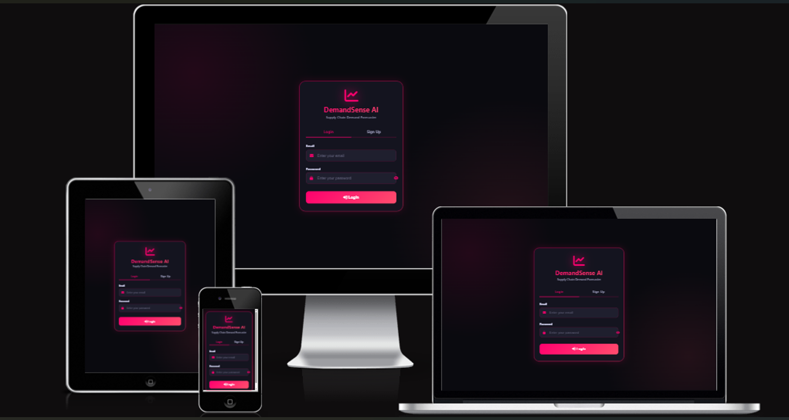

# 🎯 DemandSense AI
DemandSense AI is an AI-powered demand forecasting and inventory optimisation platform designed to help businesses predict future product demand, optimise stock levels, analyse scenarios, and generate intelligent business insights.
The project follows a modular architecture that separates frontend assets, backend logic, API routes, test suites, and supporting resources to improve maintainability, scalability, and ease of deployment.

 Here is the link to the DemandSense AI Application-heroku where you can login to access the AI-powered demand forecasting and inventory optimisation platform [link](https://demandsense-ai-f26d0ae2b62b.herokuapp.com/login)

    
